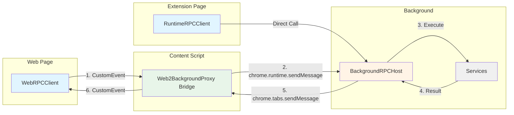
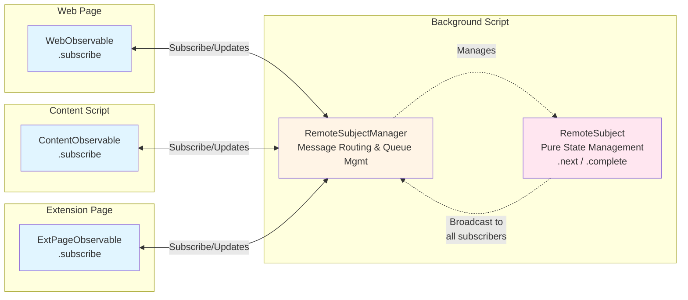

# Chrome Extension RPC (crx-rpc)

English | [简体中文](./README.zh-CN.md)

A lightweight, type-safe RPC framework for Chrome Extensions supporting communication between web pages, content scripts, and background scripts. Built with TypeScript for maximum type safety and developer experience.

## Features

- 🔒 **Type Safety**: Full TypeScript type support with automatic proxy type generation
- 🚀 **Easy to Use**: Auto-generated client proxies based on interfaces
- 🔄 **Bidirectional Communication**: Supports web page ↔ content script ↔ background script
- 📦 **Zero Configuration**: No manual method binding required
- 🎯 **Observable Support**: Built-in support for reactive data streams with RemoteSubject
- 🛡️ **Error Handling**: Preserves stack traces and error types across boundaries
- 🧹 **Resource Management**: Built-in disposable pattern for clean resource cleanup

## Installation

```bash
npm install crx-rpc
# or
pnpm add crx-rpc
# or
yarn add crx-rpc
```

## Quick Start

### 1. Define Service Interface

```typescript
// services/math.ts
import { createIdentifier } from 'crx-rpc';

interface IMathService {
    add(a: number, b: number): Promise<number>;
    subtract(a: number, b: number): Promise<number>;
    multiply(a: number, b: number): Promise<number>;
    divide(a: number, b: number): Promise<number>;
}

// Create service identifier
export const IMathService = createIdentifier<IMathService>('MathService');
```

### 2. Implement Service (Background Script)

```typescript
// background.ts
import { BackgroundRPCHost } from 'crx-rpc';
import { IMathService } from './services/math';

class MathService implements IMathService {
    async add(a: number, b: number): Promise<number> {
        return a + b;
    }

    async subtract(a: number, b: number): Promise<number> {
        return a - b;
    }

    async multiply(a: number, b: number): Promise<number> {
        return a * b;
    }

    async divide(a: number, b: number): Promise<number> {
        if (b === 0) throw new Error('Division by zero');
        return a / b;
    }
}

// Register service with optional logging
const rpc = new BackgroundRPCHost(true); // Enable logging
// const rpc = new BackgroundRPCHost(); // Disable logging (default)
rpc.register(IMathService, new MathService());
```

### 3. Initialize Content Script

Content scripts can work in two modes:

#### Option A: As a Bridge (for web page communication)

```typescript
// content.ts
import { Web2BackgroundProxy } from 'crx-rpc';

// Initialize RPC bridge for web page ↔ background communication
const contentRpc = new Web2BackgroundProxy();

// Remember to dispose when cleanup is needed
// contentRpc.dispose();
```

#### Option B: As a Direct Client

```typescript
// content.ts
import { RuntimeRPCClient } from 'crx-rpc';
import { IMathService } from './services/math';

// Use content script as a direct RPC client
const client = new RuntimeRPCClient();
const mathService = client.createWebRPCService(IMathService);

// Direct calls to background services
const result = await mathService.add(5, 3);
console.log('Result from content script:', result);

// Remember to dispose when cleanup is needed
// client.dispose();
```

#### Option C: Both Bridge and Client

```typescript
// content.ts
import { Web2BackgroundProxy, RuntimeRPCClient } from 'crx-rpc';
import { IMathService } from './services/math';

// Initialize bridge for web pages
const bridge = new Web2BackgroundProxy();

// Also use as direct client
const client = new RuntimeRPCClient();
const mathService = client.createWebRPCService(IMathService);

// Content script can make its own RPC calls
const result = await mathService.multiply(2, 3);
console.log('Content script calculation:', result);
```

### 4. Use Client (Web Page)

```typescript
// web-page.ts
import { WebRPCClient } from 'crx-rpc';
import { IMathService } from './services/math';

async function calculate() {
    // Create RPC client
    const client = new WebRPCClient();

    // Create type-safe service proxy
    const mathService = client.createWebRPCService(IMathService);

    // Type-safe method calls
    const sum = await mathService.add(1, 2); // TypeScript knows this returns Promise<number>
    const difference = await mathService.subtract(10, 5);
    const product = await mathService.multiply(3, 4);
    const quotient = await mathService.divide(15, 3);

    console.log('Results:', { sum, difference, product, quotient });

    // Remember to dispose when cleanup is needed
    // client.dispose();
}
```

## Architecture

### Complete Communication Topology



### Communication Paths

| Path | Method | Description |
|------|--------|-------------|
| **Web Page → Background** | CustomEvent + chrome.runtime | Through Web2BackgroundProxy bridge |
| **Content Script → Background** | chrome.runtime | Direct communication |
| **Extension Page → Background** | chrome.runtime | Direct communication |
| **Extension Page → Content Script** | chrome.tabs + TabRPCClient | Tab-specific access |
| **Background → All Contexts** | RemoteSubject broadcast | Real-time data streaming |

### Key Components

- **WebRPCClient**: Client for web pages using window events
- **Web2BackgroundProxy**: Bridge that forwards messages between web and background
- **RuntimeRPCClient**: Direct RPC client for content scripts (bypasses bridge)
- **BackgroundRPCHost**: Service registry and handler in the background script
- **RPCClient**: Base client with service proxy generation

## Logging Support

The framework includes built-in logging support for debugging and monitoring RPC calls.

### Enable Logging

```typescript
// Enable logging in BackgroundRPCHost
const rpc = new BackgroundRPCHost(true); // Enable logging
// const rpc = new BackgroundRPCHost(); // Disable logging (default)

// Example output:
// [RPC] Call: MathService.add { id: "123", args: [5, 3], senderId: 456, timestamp: "2025-09-01T10:00:00.000Z" }
// [RPC] Success: MathService.add { id: "123", result: 8, timestamp: "2025-09-01T10:00:00.001Z" }

// For errors:
// [RPC] Error: MathService.divide { id: "124", error: "Division by zero", timestamp: "2025-09-01T10:00:01.000Z" }
```

### Log Output

When logging is enabled, the following information is logged:

- **Function Calls**: Service name, method name, arguments, sender ID, and timestamp
- **Success Responses**: Service name, method name, result, and timestamp  
- **Error Responses**: Service name, method name, error message, and timestamp
- **Unknown Services/Methods**: Warnings for invalid service or method calls

### Use Cases

- **Development**: Debug RPC communication during development
- **Production Monitoring**: Track RPC usage patterns and performance
- **Troubleshooting**: Identify failed calls and error patterns
- **Security Auditing**: Monitor RPC access patterns

## Observable Support

The framework includes built-in support for reactive data streams using `RemoteSubject` and `Observable` patterns with a centralized message management system.

### Remote Subject Manager & Remote Subject (Background Script)

The `RemoteSubjectManager` acts as a centralized message hub that handles all subscription management and message routing, while `RemoteSubject` focuses purely on state management.

```typescript
// background.ts
import { BackgroundRPCHost, RemoteSubjectManager, createIdentifier } from 'crx-rpc';

interface ICounterObservable {
    value: number;
}

const ICounterObservable = createIdentifier<ICounterObservable>('Counter');

const rpc = new BackgroundRPCHost();

// Create a centralized subject manager
const subjectManager = new RemoteSubjectManager();

// Create a remote subject through the manager
const counterSubject = subjectManager.createSubject(
    ICounterObservable, 
    'main', 
    { value: 0 }
);

// Update value and broadcast to all subscribers
setInterval(() => {
    const newValue = { value: Math.floor(Math.random() * 100) };
    counterSubject.next(newValue);
}, 1000);

// The manager handles:
// - Message routing and subscription management
// - Queuing subscriptions that arrive before subjects are created
// - Automatic cleanup when tabs are closed
// - Broadcasting to multiple subscribers

// Cleanup
// subjectManager.dispose(); // This will dispose all subjects
```

### Key Features of RemoteSubjectManager

- **Centralized Message Hub**: All observable-related messages are handled by the manager
- **Queue Management**: Subscriptions received before subject creation are queued and processed later
- **Resource Management**: Automatic cleanup of subscriptions when tabs are closed
- **Type Safety**: Full TypeScript support with proper typing throughout

### Architecture



### Subscribing from Web Page

```typescript
// web-page.ts
import { WebObservable, createIdentifier } from 'crx-rpc';

interface ICounterObservable {
    value: number;
}

const ICounterObservable = createIdentifier<ICounterObservable>('Counter');

// Subscribe to remote observable
const observable = new WebObservable(
    ICounterObservable,
    'main',
    (value) => {
        console.log('Counter updated:', value.value);
    }
);

// Cleanup when done
// observable.dispose();
```

### Subscribing from Content Script

```typescript
// content.ts
import { ContentObservable, createIdentifier } from 'crx-rpc';

interface ICounterObservable {
    value: number;
}

const ICounterObservable = createIdentifier<ICounterObservable>('Counter');

// Content script can directly subscribe to observables
const observable = new ContentObservable(
    ICounterObservable,
    'main',
    (value) => {
        console.log('Counter from content script:', value.value);
        // Content script can react to real-time updates
        updateUI(value.value);
    }
);

// Cleanup when done
// observable.dispose();
```

### Subscribing from Extension Page

```typescript
// popup.ts / options.ts
import { ExtPageObservable, createIdentifier } from 'crx-rpc';

interface ICounterObservable {
    value: number;
}

const ICounterObservable = createIdentifier<ICounterObservable>('Counter');

// Extension page can subscribe to background observables
const observable = new ExtPageObservable(
    ICounterObservable,
    'main',
    (value) => {
        console.log('Counter from extension page:', value.value);
        document.getElementById('counter').textContent = value.value.toString();
    }
);

// Cleanup when done
window.addEventListener('unload', () => {
    observable.dispose();
});
```

### Observable Communication Patterns

The Observable system supports multiple communication patterns with centralized management:

```typescript
// Pattern 1: Background → Web Page (via Content Script bridge)
// Background: RemoteSubjectManager creates and manages RemoteSubject
// Background: RemoteSubject.next() → Manager routes to subscribers
// Web Page: WebObservable.subscribe()

// Pattern 2: Background → Content Script (direct)
// Background: RemoteSubject.next() → Manager routes directly
// Content Script: ContentObservable.subscribe()

// Pattern 3: Background → Both Web Page and Content Script
// Background: RemoteSubject.next() → Manager broadcasts to all subscribers
// Web Page: WebObservable.subscribe()
// Content Script: ContentObservable.subscribe()

// Pattern 4: Subscription before Subject Creation (Queue Management)
// Subscriber: WebObservable.subscribe() → Manager queues subscription
// Background: Later creates RemoteSubject → Manager processes queued subscriptions
// Result: No missed initial values, proper subscription ordering
```

## Advanced Usage

### Resource Management with Disposables

All RPC components extend the `Disposable` class for proper cleanup:

```typescript
import { WebRPCClient, Web2BackgroundProxy, BackgroundRPCHost } from 'crx-rpc';

const client = new WebRPCClient();
const contentRpc = new Web2BackgroundProxy();
const backgroundRpc = new BackgroundRPCHost();

// Proper cleanup
function cleanup() {
    client.dispose();
    contentRpc.dispose();
    backgroundRpc.dispose();
}

// Check if already disposed
if (!client.isDisposed()) {
    const service = client.createWebRPCService(IMathService);
    // Use service...
}
```

### Extension Page Accessing Content Script Services

Extension pages can access content script services using `TabRPCClient` by specifying the target tab ID:

```typescript
// popup.ts
import { TabRPCClient } from 'crx-rpc';
import { IContentService } from './services';

// Get current active tab
const [tab] = await chrome.tabs.query({ active: true, currentWindow: true });

if (tab.id) {
    // Create RPC client for specific tab
    const tabClient = new TabRPCClient(tab.id);
    
    // Access content script services in that tab
    const contentService = tabClient.createWebRPCService(IContentService);
    
    // Call content script methods
    const result = await contentService.getDOMInfo();
    console.log('DOM info from content script:', result);
    
    // Cleanup when done
    window.addEventListener('unload', () => {
        tabClient.dispose();
    });
}
```

#### Use Cases for Extension Page → Content Script Communication:

1. **DOM Inspection**: Popup queries content script for page information
2. **User Actions**: Options page triggers content script actions on specific tabs
3. **Multi-tab Management**: Sidepanel coordinates actions across multiple tabs
4. **Live Preview**: Extension page gets real-time updates from content script

#### Complete Example: Popup with Tab-specific Services

```typescript
// content.ts - Register services in content script
import { ContentRPCHost } from 'crx-rpc';
import { IPageService } from './services';

class PageService implements IPageService {
    async getTitle(): Promise<string> {
        return document.title;
    }
    
    async getSelection(): Promise<string> {
        return window.getSelection()?.toString() || '';
    }
    
    async highlightText(text: string): Promise<void> {
        // Highlight logic...
    }
}

const contentHost = new ContentRPCHost();
contentHost.register(IPageService, new PageService());

// popup.ts - Access content script from popup
import { TabRPCClient, RuntimeRPCClient } from 'crx-rpc';
import { IPageService, IMathService } from './services';

// Access background services
const bgClient = new RuntimeRPCClient();
const mathService = bgClient.createWebRPCService(IMathService);

// Access content script services in active tab
const [tab] = await chrome.tabs.query({ active: true, currentWindow: true });
if (tab.id) {
    const tabClient = new TabRPCClient(tab.id);
    const pageService = tabClient.createWebRPCService(IPageService);
    
    // Get page info from content script
    const title = await pageService.getTitle();
    const selection = await pageService.getSelection();
    
    // Process with background service
    const result = await mathService.calculate(selection.length);
    
    // Update popup UI
    document.getElementById('title').textContent = title;
    document.getElementById('result').textContent = result.toString();
}
```

## Usage Scenarios

### Scenario 1: Web Page Only
- Web pages need to communicate with background services
- Use: `WebRPCClient` + `Web2BackgroundProxy` bridge

### Scenario 2: Content Script Only  
- Content scripts need direct access to background services
- Use: `RuntimeRPCClient` directly (no bridge needed)

### Scenario 3: Both Web Page and Content Script
- Both contexts need RPC access
- Use: `Web2BackgroundProxy` bridge + `RuntimeRPCClient` for direct access

### Scenario 4: Real-time Data Streaming
- Background needs to push updates to multiple contexts
- Use: `RemoteSubject` + `WebObservable`/`ContentObservable`

## API Reference

### Core Classes

- **`BackgroundRPCHost`**: Service registry and message handler for background scripts
- **`Web2BackgroundProxy`**: Message bridge between web pages and background scripts
- **`WebRPCClient`**: RPC client for web pages
- **`RuntimeRPCClient`**: Direct RPC client for content scripts
- **`RemoteSubjectManager`**: Centralized observable message management system

### Observable Classes

- **`RemoteSubjectManager`**: Centralized message hub that manages subscriptions and message routing for all observables
- **`RemoteSubject<T>`**: Pure state management observable that works with the manager to broadcast updates
- **`WebObservable<T>`**: Observable subscriber for web pages
- **`ContentObservable<T>`**: Observable subscriber for content scripts

### Utility Functions

- **`createIdentifier<T>(key: string)`**: Creates a type-safe service identifier

### Interfaces

- **`Identifier<T>`**: Type-safe service identifier interface
- **`RpcRequest`**: RPC request message structure
- **`RpcResponse`**: RPC response message structure
- **`IMessageAdapter`**: Message transport abstraction interface
- **`IDisposable`**: Resource management interface

## License

MIT