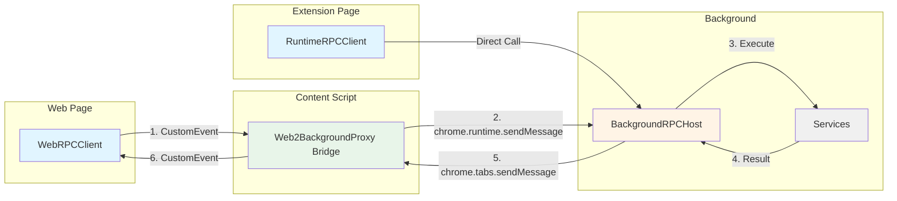
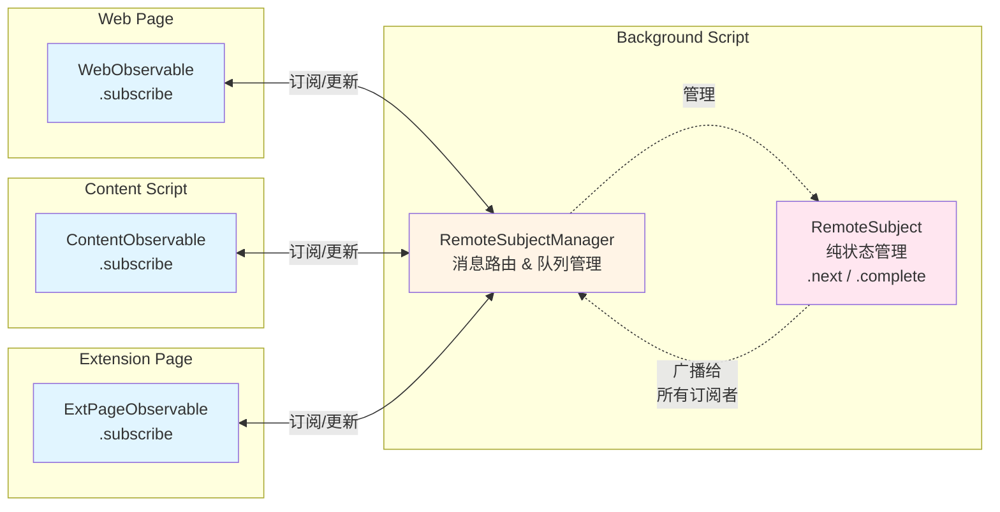

# Chrome Extension RPC (crx-rpc)

[English](./README.md) | 简体中文

一个轻量级、类型安全的 Chrome 扩展 RPC 框架，支持网页、内容脚本（Content Script）和后台脚本（Background Script）之间的通信。基于 TypeScript 构建，提供极致的类型安全和开发体验。

## 特性

- 🔒 **类型安全**：完全的 TypeScript 类型支持，自动生成代理类型
- 🚀 **易于使用**：基于接口自动生成客户端代理
- 🔄 **双向通信**：支持 网页 ↔ 内容脚本 ↔ 后台脚本 之间的双向通信
- 📦 **零配置**：无需手动绑定方法
- 🎯 **Observable 支持**：内置 RemoteSubject 支持响应式数据流
- 🛡️ **错误处理**：跨边界保留堆栈跟踪和错误类型
- 🧹 **资源管理**：内置 Disposable 模式，便于资源清理

## 安装

```bash
npm install crx-rpc
# or
pnpm add crx-rpc
# or
yarn add crx-rpc
```

## 快速开始

### 1. 定义服务接口

```typescript
// services/math.ts
import { createIdentifier } from 'crx-rpc';

interface IMathService {
    add(a: number, b: number): Promise<number>;
    subtract(a: number, b: number): Promise<number>;
    multiply(a: number, b: number): Promise<number>;
    divide(a: number, b: number): Promise<number>;
}

// 创建服务标识符
export const IMathService = createIdentifier<IMathService>('MathService');
```

### 2. 实现服务 (Background Script)

```typescript
// background.ts
import { BackgroundRPCHost } from 'crx-rpc';
import { IMathService } from './services/math';

class MathService implements IMathService {
    async add(a: number, b: number): Promise<number> {
        return a + b;
    }

    async subtract(a: number, b: number): Promise<number> {
        return a - b;
    }

    async multiply(a: number, b: number): Promise<number> {
        return a * b;
    }

    async divide(a: number, b: number): Promise<number> {
        if (b === 0) throw new Error('Division by zero');
        return a / b;
    }
}

// 注册服务（可选开启日志）
const rpc = new BackgroundRPCHost(true); // 开启日志
// const rpc = new BackgroundRPCHost(); // 关闭日志（默认）
rpc.register(IMathService, new MathService());
```

### 3. 初始化 Content Script

Content scripts 有两种工作模式：

#### 选项 A: 作为桥接器 (用于网页通信)

```typescript
// content.ts
import { Web2BackgroundProxy } from 'crx-rpc';

// 初始化 RPC 桥接器，用于 网页 ↔ 后台 通信
const contentRpc = new Web2BackgroundProxy();

// 需要清理时调用 dispose
// contentRpc.dispose();
```

#### 选项 B: 作为直接客户端

```typescript
// content.ts
import { RuntimeRPCClient } from 'crx-rpc';
import { IMathService } from './services/math';

// 将 content script 作为直接的 RPC 客户端使用
const client = new RuntimeRPCClient();
const mathService = client.createWebRPCService(IMathService);

// 直接调用后台服务
const result = await mathService.add(5, 3);
console.log('Result from content script:', result);

// 需要清理时调用 dispose
// client.dispose();
```

#### 选项 C: 既作为桥接器又作为客户端

```typescript
// content.ts
import { Web2BackgroundProxy, RuntimeRPCClient } from 'crx-rpc';
import { IMathService } from './services/math';

// 初始化网页桥接器
const bridge = new Web2BackgroundProxy();

// 同时作为直接客户端使用
const client = new RuntimeRPCClient();
const mathService = client.createWebRPCService(IMathService);

// Content script 可以发起自己的 RPC 调用
const result = await mathService.multiply(2, 3);
console.log('Content script calculation:', result);
```

### 4. 使用客户端 (Web Page)

```typescript
// web-page.ts
import { WebRPCClient } from 'crx-rpc';
import { IMathService } from './services/math';

async function calculate() {
    // 创建 RPC 客户端
    const client = new WebRPCClient();

    // 创建类型安全的服务代理
    const mathService = client.createWebRPCService(IMathService);

    // 类型安全的方法调用
    const sum = await mathService.add(1, 2); // TypeScript 知道这返回 Promise<number>
    const difference = await mathService.subtract(10, 5);
    const product = await mathService.multiply(3, 4);
    const quotient = await mathService.divide(15, 3);

    console.log('Results:', { sum, difference, product, quotient });

    // 需要清理时调用 dispose
    // client.dispose();
}
```

## 架构

### 完整通信拓扑



### 通信路径

| 路径 | 方法 | 描述 |
|------|--------|-------------|
| **Web Page → Background** | CustomEvent + chrome.runtime | 通过 Web2BackgroundProxy 桥接 |
| **Content Script → Background** | chrome.runtime | 直接通信 |
| **Extension Page → Background** | chrome.runtime | 直接通信 |
| **Extension Page → Content Script** | chrome.tabs + TabRPCClient | 指定 Tab 访问 |
| **Background → All Contexts** | RemoteSubject broadcast | 实时数据流 |

### 核心组件

- **WebRPCClient**: 用于网页的客户端，使用 window 事件
- **Web2BackgroundProxy**: 在网页和后台之间转发消息的桥接器
- **RuntimeRPCClient**: 用于 Content Script 的直接 RPC 客户端（绕过桥接）
- **BackgroundRPCHost**: 后台脚本中的服务注册表和处理器
- **RPCClient**: 带有服务代理生成的基类客户端

## 日志支持

框架内置了日志支持，用于调试和监控 RPC 调用。

### 开启日志

```typescript
// 在 BackgroundRPCHost 中开启日志
const rpc = new BackgroundRPCHost(true); // 开启日志
// const rpc = new BackgroundRPCHost(); // 关闭日志（默认）

// 示例输出:
// [RPC] Call: MathService.add { id: "123", args: [5, 3], senderId: 456, timestamp: "2025-09-01T10:00:00.000Z" }
// [RPC] Success: MathService.add { id: "123", result: 8, timestamp: "2025-09-01T10:00:00.001Z" }

// 错误情况:
// [RPC] Error: MathService.divide { id: "124", error: "Division by zero", timestamp: "2025-09-01T10:00:01.000Z" }
```

### 日志输出

开启日志后，将记录以下信息：

- **函数调用**: 服务名、方法名、参数、发送者 ID 和时间戳
- **成功响应**: 服务名、方法名、结果和时间戳
- **错误响应**: 服务名、方法名、错误信息和时间戳
- **未知服务/方法**: 无效服务或方法调用的警告

### 使用场景

- **开发**: 在开发过程中调试 RPC 通信
- **生产监控**: 追踪 RPC 使用模式和性能
- **故障排查**: 识别失败的调用和错误模式
- **安全审计**: 监控 RPC 访问模式

## Observable 支持

框架内置了对响应式数据流的支持，使用 `RemoteSubject` 和 `Observable` 模式以及中心化的消息管理系统。

### Remote Subject Manager & Remote Subject (Background Script)

`RemoteSubjectManager` 作为一个中心化的消息枢纽，处理所有的订阅管理和消息路由，而 `RemoteSubject` 专注于状态管理。

```typescript
// background.ts
import { BackgroundRPCHost, RemoteSubjectManager, createIdentifier } from 'crx-rpc';

interface ICounterObservable {
    value: number;
}

const ICounterObservable = createIdentifier<ICounterObservable>('Counter');

const rpc = new BackgroundRPCHost();

// 创建中心化 subject 管理器
const subjectManager = new RemoteSubjectManager();

// 通过管理器创建 remote subject
const counterSubject = subjectManager.createSubject(
    ICounterObservable, 
    'main', 
    { value: 0 }
);

// 更新值并广播给所有订阅者
setInterval(() => {
    const newValue = { value: Math.floor(Math.random() * 100) };
    counterSubject.next(newValue);
}, 1000);

// 管理器处理:
// - 消息路由和订阅管理
// - 队列处理（在 subject 创建之前的订阅）
// - Tab 关闭时的自动清理
// - 向多个订阅者广播

// 清理
// subjectManager.dispose(); // 这将销毁所有 subject
```

### RemoteSubjectManager 的关键特性

- **中心化消息枢纽**: 所有 observable 相关的消息都由管理器处理
- **队列管理**: 在 subject 创建之前收到的订阅会被排队并在稍后处理
- **资源管理**: Tab 关闭时自动清理订阅
- **类型安全**: 全程完整的 TypeScript 支持

### 架构



### 从网页订阅

```typescript
// web-page.ts
import { WebObservable, createIdentifier } from 'crx-rpc';

interface ICounterObservable {
    value: number;
}

const ICounterObservable = createIdentifier<ICounterObservable>('Counter');

// 订阅远程 observable
const observable = new WebObservable(
    ICounterObservable,
    'main',
    (value) => {
        console.log('Counter updated:', value.value);
    }
);

// 完成后清理
// observable.dispose();
```

### 从 Content Script 订阅

```typescript
// content.ts
import { ContentObservable, createIdentifier } from 'crx-rpc';

interface ICounterObservable {
    value: number;
}

const ICounterObservable = createIdentifier<ICounterObservable>('Counter');

// Content script 可以直接订阅 observables
const observable = new ContentObservable(
    ICounterObservable,
    'main',
    (value) => {
        console.log('Counter from content script:', value.value);
        // Content script 可以对实时更新做出反应
        updateUI(value.value);
    }
);

// 完成后清理
// observable.dispose();
```

### 从 Extension Page 订阅

```typescript
// popup.ts / options.ts
import { ExtPageObservable, createIdentifier } from 'crx-rpc';

interface ICounterObservable {
    value: number;
}

const ICounterObservable = createIdentifier<ICounterObservable>('Counter');

// Extension page 可以订阅后台 observables
const observable = new ExtPageObservable(
    ICounterObservable,
    'main',
    (value) => {
        console.log('Counter from extension page:', value.value);
        document.getElementById('counter').textContent = value.value.toString();
    }
);

// 完成后清理
window.addEventListener('unload', () => {
    observable.dispose();
});
```

### Observable 通信模式

Observable 系统支持多种通信模式，并进行统一管理：

```typescript
// 模式 1: Background → Web Page (通过 Content Script 桥接)
// Background: RemoteSubjectManager 创建并管理 RemoteSubject
// Background: RemoteSubject.next() → Manager 路由给订阅者
// Web Page: WebObservable.subscribe()

// 模式 2: Background → Content Script (直接)
// Background: RemoteSubject.next() → Manager 直接路由
// Content Script: ContentObservable.subscribe()

// 模式 3: Background → Both Web Page and Content Script
// Background: RemoteSubject.next() → Manager 广播给所有订阅者
// Web Page: WebObservable.subscribe()
// Content Script: ContentObservable.subscribe()

// 模式 4: Subject 创建前的订阅 (队列管理)
// Subscriber: WebObservable.subscribe() → Manager 将订阅排队
// Background: 稍后创建 RemoteSubject → Manager 处理排队的订阅
// 结果: 不会错过初始值，正确的订阅顺序
```

## 高级用法

### 使用 Disposables 进行资源管理

所有 RPC 组件都继承自 `Disposable` 类以便于正确清理：

```typescript
import { WebRPCClient, Web2BackgroundProxy, BackgroundRPCHost } from 'crx-rpc';

const client = new WebRPCClient();
const contentRpc = new Web2BackgroundProxy();
const backgroundRpc = new BackgroundRPCHost();

// 正确清理
function cleanup() {
    client.dispose();
    contentRpc.dispose();
    backgroundRpc.dispose();
}

// 检查是否已销毁
if (!client.isDisposed()) {
    const service = client.createWebRPCService(IMathService);
    // 使用服务...
}
```

### Extension Page 访问 Content Script 服务

Extension pages 可以通过指定目标 tab ID 使用 `TabRPCClient` 访问 content script 服务：

```typescript
// popup.ts
import { TabRPCClient } from 'crx-rpc';
import { IContentService } from './services';

// 获取当前活跃 tab
const [tab] = await chrome.tabs.query({ active: true, currentWindow: true });

if (tab.id) {
    // 为特定 tab 创建 RPC 客户端
    const tabClient = new TabRPCClient(tab.id);
    
    // 访问该 tab 中的 content script 服务
    const contentService = tabClient.createWebRPCService(IContentService);
    
    // 调用 content script 方法
    const result = await contentService.getDOMInfo();
    console.log('DOM info from content script:', result);
    
    // 完成后清理
    window.addEventListener('unload', () => {
        tabClient.dispose();
    });
}
```

#### Extension Page → Content Script 通信场景:

1. **DOM 检查**: Popup 查询 Content Script 获取页面信息
2. **用户操作**: Options 页面在特定 Tab 上触发 Content Script 操作
3. **多 Tab 管理**: Sidepanel 协调多个 Tab 之间的操作
4. **实时预览**: Extension Page 从 Content Script 获取实时更新

#### 完整示例: 带有 Tab 专属服务的 Popup

```typescript
// content.ts - 在 content script 中注册服务
import { ContentRPCHost } from 'crx-rpc';
import { IPageService } from './services';

class PageService implements IPageService {
    async getTitle(): Promise<string> {
        return document.title;
    }
    
    async getSelection(): Promise<string> {
        return window.getSelection()?.toString() || '';
    }
    
    async highlightText(text: string): Promise<void> {
        // 高亮逻辑...
    }
}

const contentHost = new ContentRPCHost();
contentHost.register(IPageService, new PageService());

// popup.ts - 从 popup 访问 content script
import { TabRPCClient, RuntimeRPCClient } from 'crx-rpc';
import { IPageService, IMathService } from './services';

// 访问后台服务
const bgClient = new RuntimeRPCClient();
const mathService = bgClient.createWebRPCService(IMathService);

// 访问活跃 tab 中的 content script 服务
const [tab] = await chrome.tabs.query({ active: true, currentWindow: true });
if (tab.id) {
    const tabClient = new TabRPCClient(tab.id);
    const pageService = tabClient.createWebRPCService(IPageService);
    
    // 从 content script 获取页面信息
    const title = await pageService.getTitle();
    const selection = await pageService.getSelection();
    
    // 使用后台服务处理
    const result = await mathService.calculate(selection.length);
    
    // 更新 popup UI
    document.getElementById('title').textContent = title;
    document.getElementById('result').textContent = result.toString();
}
```

## 使用场景

### 场景 1: 仅网页
- 网页需要与后台服务通信
- 使用: `WebRPCClient` + `Web2BackgroundProxy` 桥接

### 场景 2: 仅 Content Script
- Content scripts 需要直接访问后台服务
- 使用: `RuntimeRPCClient` 直接访问（无需桥接）

### 场景 3: 网页和 Content Script
- 两种上下文都需要 RPC 访问
- 使用: `Web2BackgroundProxy` 桥接 + `RuntimeRPCClient` 直接访问

### 场景 4: 实时数据流
- 后台需要向多个上下文推送更新
- 使用: `RemoteSubject` + `WebObservable`/`ContentObservable`

## API 参考

### 核心类

- **`BackgroundRPCHost`**: 后台脚本的服务注册表和消息处理器
- **`Web2BackgroundProxy`**: 网页和后台脚本之间的消息桥接器
- **`WebRPCClient`**: 网页的 RPC 客户端
- **`RuntimeRPCClient`**: Content scripts 的直接 RPC 客户端
- **`RemoteSubjectManager`**: 中心化的 observable 消息管理系统

### Observable 类

- **`RemoteSubjectManager`**: 管理所有 observable 的订阅和消息路由的中心化消息枢纽
- **`RemoteSubject<T>`**: 纯状态管理 observable，与管理器配合广播更新
- **`WebObservable<T>`**: 网页的 observable 订阅者
- **`ContentObservable<T>`**: Content scripts 的 observable 订阅者

### 工具函数

- **`createIdentifier<T>(key: string)`**: 创建类型安全的服务标识符

### 接口

- **`Identifier<T>`**: 类型安全的服务标识符接口
- **`RpcRequest`**: RPC 请求消息结构
- **`RpcResponse`**: RPC 响应消息结构
- **`IMessageAdapter`**: 消息传输抽象接口
- **`IDisposable`**: 资源管理接口

## License

MIT